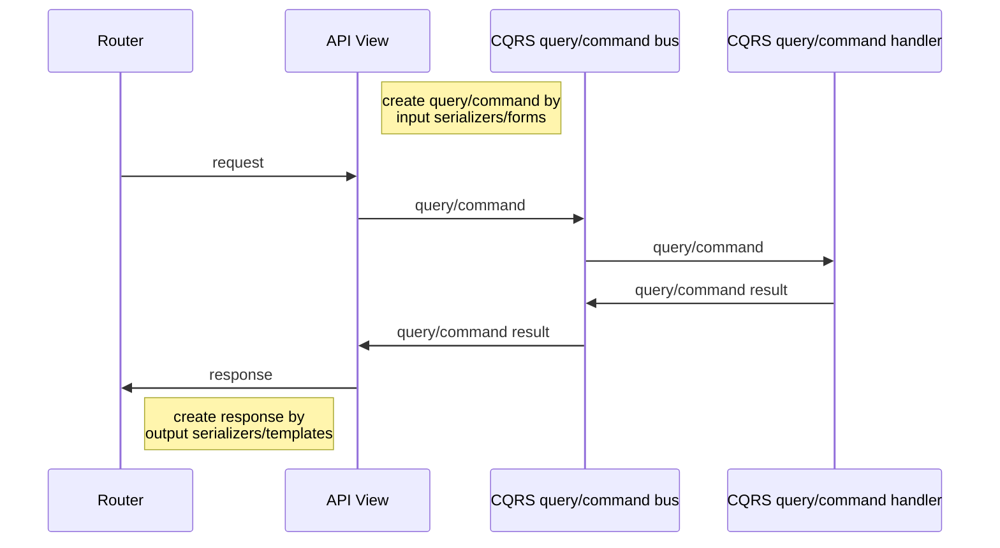

# Django CQRS Demo

## About

The repository contains example of implementation CQRS architecture principles at django project.

## Architecture principles

- compromise separation infrastructure from business layers
- communication between layers via simple serializable objects
- all business logic, validation, is contained in the business layer
- API, views, celery tasks prepares raw data for transmission to the business layer
- a unified approach to building the interaction of levels
- wide using interfaces, dependency injection
- keep the usual django folder organization

## Workflow diagrams

### API, pages 



## Code key principles

- typing, linters
- tests (pytest)
- single class per file (model per file,...)
- documentation API
- separate view per API method
- reduction of cognitive load by small modules

## Code structure

```bash
< PROJECT ROOT >
   |
   |-- .github/                              # GitHub workflows
   |    |-- ...
   | 
   |-- ci/                                   # CI related files 
   |    |-- docker-compose.yml               # Run test environment  
   |
   |-- docker/                               # Files to build docker image 
   |    |-- nginx                            # Nginx files
   |    |    |-- nginx.conf                  # Nginx config 
   |    |    |-- uwsgi_params                # Include file for uwsgi params
   |    |
   |    |-- server                           # Server command scripts 
   |    |    |-- backend.sh                  # Run django 
   |    |    |-- celery_beat.sh              # Run celery beat 
   |    |    |-- celery_worker.sh            # Run celery worker 
   |    |    |-- flower.sh                   # Run flower 
   |    | 
   |    |-- .dockerignore.production         # Docker ignore files for production image. Exclude tests 
   |    |-- Dockerfile                       # Dockerfile to test, production image build 
   |    
   |-- locale/      
   |    |-- ...                              # Locale files
   |
   |-- scripts/                              # Tools
   |    |-- lint.sh                          # Lint script 
   |
   |-- server/
   |    |-- apps/                            # Django apps 
   |    |    |-- core                        # Core utils
   |    |    |    |-- ...
   |    |    | ...
   |    |
   |    |-- settings/                        # Application settings 
   |    |    |-- components/                 # Settings grouped by components. Use `split_settings` library
   |    |    |    |-- ...     
   |    |    |   
   |    |    |-- environments/               # Specific settings for envs
   |    |    |    |-- build.py               # Docker build settings
   |    |    |    |-- development.py.example # Draft for local development settings (should be cloned to development.py and updated to your environment)
   |    |    |    |-- production.py          # Production settings
   |    |    |    |-- test.py                # CI tests settings
   |    |    |  
   |    |-- celery_app.py                    # Celery entrypoint
   |    |-- urls.py                          # Django routing
   |    |-- wsgi.py                          # WSGI app server entrypoint
   |    |-- asgi.py                          # ASGI app server entrypoint
   |                               
   |-- tests/                                # Tests folder
   |    |-- ...
   |
   |-- ...
   |-- .pre-commit-config.yaml               # Pre commit config. To install run: "make install_pre_commit"
   |-- pyproject.toml                        # Poetry deps, tools settings
   |-- setup.cfg                             # Tools settings
   |-- Makefile                              # Useful scripts. To use run: "make <command>" 
   |-- ... 
```

### Django application structure

```bash
< APP ROOT >
   |
   |-- admin/                              # admin panel related modules 
   |    |-- inlines/                       # inlines
   |    |    | ...
   |    |-- ... 
   |    
   |-- api/                                # api related modules 
   |    |-- routes/                        # routes declarations 
   |    |    |-- ...
   |    |
   |    |-- serializers/                   # serializers
   |    |    |-- ...
   |    |
   |    |-- views/                         # views 
   |    |    |-- ...
   |    |
   |    |-- urls.py                        # urls registration based on routes 
   |
   |-- logic/                              # business layer logic
   |    |-- commands/ 
   |    |    |-- ...
   |    |    |-- main.py                   # commands registration 
   |    |
   |    |-- queries/
   |    |    |-- ...
   |    |    |-- main.py                   # queries registration 
   |    |
   |    |-- services/ 
   |    |    |-- ...                       # business layer services
   |    |
   |    |-- interfaces/ 
   |    |    |-- ...                       # business layer interfaces 
   |    
   |-- management/                         # django commands
   |    |-- ...                       
   |
   |-- migrations/                         # django database migrations 
   |    |-- ...                       
   | 
   |-- models/                             # models
   |    |-- managers/                      # models managers
   |    |    |-- ...
   |    |-- enums/                         # enums 
   |    |    |-- ...
   |    |
   |    |-- ...
   |
   |-- pages/                              # django views modules
   |    |-- views                          # views 
   |    |     |-- ...
   |    |
   |    |-- urls.py                        # urls routing registration  
   |    
   |-- services/
   |    |-- ...                            # infrastructure layer services
   |
   |-- tasks/
   |    |-- ...                            # async tasks 
   | 
   |-- apps.py                             # application config 
```