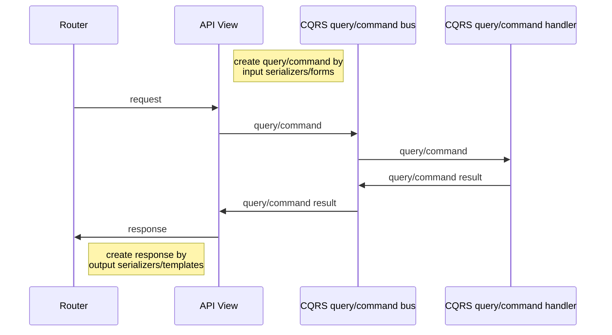

# Implementation 

## Principles

- compromise separation infrastructure from business layers
- communication between layers via simple serializable objects
- all business logic, validation, is contained in the business layer
- API, views, celery tasks prepares raw data for transmission to the business layer
- a unified approach to building the interaction of levels
- wide using interfaces, dependency injection
- keep the usual django folder organization

## Workflow

### API, pages

## Developing principles

- typing, linters
- tests (pytest)
- single class per file (model per file,...)
- documentation API
- separate view per API method
- reduction of cognitive load by small modules
