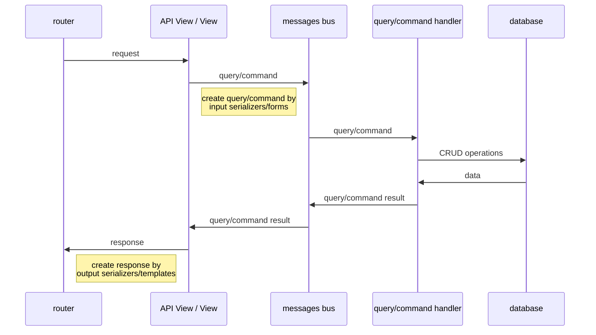

# Implementation

## Principles

- compromise separation infrastructure from business layers
- communication between layers via pure serializable objects
- all business logic and validation are contained in the business layer
- API, views, celery tasks prepares raw data for transmission to the business layer
- a unified approach to building the interaction of layers
- wide using interfaces, dependency injection
- keep the usual django folder organization with minimal improvements

## Coding principles

- typing, linters
- tests (pytest)
- single class per file (model per file,...)
- documentation API
- separate view per API method
- reduction of cognitive load by small modules

## Workflow

### API views, views



## Examples

### Query

```python

@dataclass(frozen=True)
class QueryResult:  # query result
    """Posts list result."""

    instances: models.QuerySet


class Query(messages.BaseQuery[QueryResult]):   # inherit from BaseQuery 
    """Post list query."""

    author_id: int | None = None


class QueryHandler(messages.BaseQueryHandler[Query]):  # inherit from BaseQueryHandler
    """Posts list query handler."""

    def handle(self, query: Query) -> QueryResult:  # handle logic
        """Handler."""
        posts = Post.objects.filter(status=PostStatus.PUBLISHED)

        if query.author_id is not None:
            posts = posts.filter(author_id=query.author_id)

        posts = posts.order_by("-created_at")

        # returns query result
        return QueryResult(
            instances=posts,
        )
```

### Command

```python
@dataclass(frozen=True)
class CommandResult: # command result dto
    """Create post output dto."""

    instance: Post


class Command(messages.BaseCommand[CommandResult]): # inherit from BaseCommand
    """Create post command."""

    user_id: int | None
    title: str
    content: str  # noqa: WPS110
    status: PostStatus


class CommandHandler(messages.BaseCommandHandler[Command]):  # inherit from BaseCommandHandler
    """Create post."""

    def handle(self, command: Command) -> CommandResult:  # handle logic
        """Main logic here."""
        if not command.user_id:
            raise AccessDeniedApplicationError()

        user = User.objects.get(id=command.user_id)
        post = Post.objects.create(
            title=command.title,
            content=command.content,
            status=command.status,
            author=user,
        )
        # returns command result
        return CommandResult( 
            instance=post,
        )
```

### Query API view

_view.py_

```python
class _InputSerializer(serializers.Serializer):
    author = serializers.IntegerField(required=False)


# inherit from: 
# - BaseListQueryView for list instances queries: list posts, users,...  
# - BaseRetrieveQueryView for retrieve instance queries: get post, user,...
class View(BaseListQueryView):
    # query to call from view.
    query = posts.list.Query
    # sometimes you need some input parameters from user. To get it - set input serializer, and
    # you will get the parameters by calling "self.extract_input_dto()".
    input_serializer = _InputSerializer
    # output dto serializer. The serializer will get "instances" field from query result.
    output_serializer = PostCardSerializer

    # Every view must override the method to create query with required parameters.
    def create_query(self) -> queries.IQuery:
        input_dto = self.extract_input_dto()
        return self.query(
            author_id=input_dto.get("author"),
        )
```

_urls.py_

```python
from apps.blogs.api.views import posts
from apps.core.api.routers import ActionsRouter

# action router is proxy to implement view per api url logic. 
router = ActionsRouter()
router.get("posts", posts.list.View.as_view())

urlpatterns = router.urls
```

### Command API view

_view.py_

```python
class _InputSerializer(serializers.Serializer):
    title = serializers.CharField()
    content = serializers.CharField()  # noqa: WPS110
    status = serializers.ChoiceField(choices=PostStatus)


# inherit from BaseCommandView
class View(BaseCommandView):
    # command to call from view. 
    command = posts.update.Command
    # sometimes you need some input parameters from user. To get it - set input serializer, and
    # you will get the parameters by calling "self.extract_input_dto()". 
    input_serializer = _InputSerializer
    # output dto serializer if need response to client.
    output_serializer = PostSerializer

    # Every view must override the method to create command with required parameters.
    def create_command(self) -> commands.ICommand:
        input_dto = self.extract_input_dto()
        return self.command(
            user_id=self.user.id if self.user else None,
            post_id=self.kwargs["pk"],
            title=input_dto["title"],
            content=input_dto["content"],
            status=input_dto["status"],
        )

    # Provides serializer data from command result.
    def get_output_serializer_instance(
            self,
            command_result: posts.create.CommandResult,
    ) -> Post:
        return command_result.instance
```

Url binding for the view is same as for query.

### Query view

_view.py_

```python
# inherit from: 
# - BaseListQueryView for list instances queries: list posts, users,...  
# - BaseRetrieveQueryView for retrieve instance queries: get post, user,...
class View(BaseListQueryView):
    # query to call from view. 
    query = posts.list.Query
    # template to render results.
    template_name = "posts/list.html"

    # Every view must override the method to create query with required parameters. 
    def create_query(self, request: HttpRequest) -> queries.IQuery:
        return self.query()
```

Add binding from url to view same as standard django mechanism.

### Command view

_view.py_

```python
class _Form(forms.ModelForm):
    class Meta:
        model = Post
        fields = ("title", "content", "status")


# inherit from BaseCommandView
class View(BaseCommandView):
    # command to call from view.
    command = posts_commands.update.Command
    # edit instance mostly requires additional html form to get data from the user. 
    # To get the instance to fill the form we need initial retrieve query. 
    initial_query = posts_queries.retrieve.Query
    # template for initial form.
    template_name = "posts/edit.html"
    # input data parser.
    form = _Form

    # build query for initial form.
    def create_initial_query(self, request: HttpRequest) -> queries.IQuery:
        return self.initial_query(
            user_id=request.user.id if request.user.is_authenticated else None,
            post_id=self.kwargs["id"],
            only_owner=True,
        )

    # build form to accept data from user. But ALL validation logic must be placed at command. 
    def create_initial_form(
            self,
            request: HttpRequest,
            initial_query_result: posts_queries.retrieve.QueryResult,
    ) -> forms.BaseForm:
        return self.form(instance=initial_query_result.instance)

    # create and fill the command with provided data
    def create_command(
            self,
            request: HttpRequest,
            form: _Form,
    ) -> commands.ICommand:
        return self.command(
            user_id=request.user.id if request.user.is_authenticated else None,
            post_id=self.kwargs["id"],
            title=form.data["title"],
            content=form.data["content"],
            status=form.data["status"],
        )

    # on command success we can do some additional logic: redirects to other page,... 
    def handle_command_success(
            self,
            request: HttpRequest,
            form: _Form,
            command_result: posts_commands.create.CommandResult,
    ) -> HttpResponse:
        return redirect("blogs:post_detail", command_result.instance.id)
```

Add url routing is same as standard django mechanism.

## Future improvements

- api requests caching
- CQRS logging, metrics